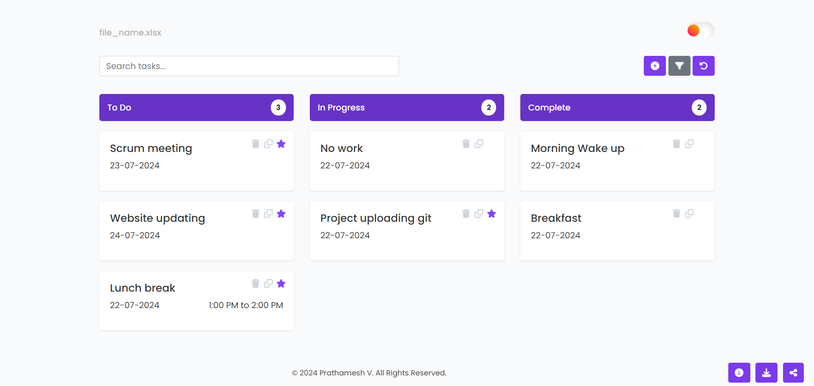

# 📋 Personalize Dashboard - Interactive Kanban To-Do List

A modern, responsive, and feature-rich **desktop-first Kanban-style Task Management Dashboard** designed to streamline your productivity. This application allows users to visually organize tasks, track deadlines, duplicate entries, undo changes, filter by date, customize themes, and export their tasks directly into professionally formatted Excel spreadsheets.

Built with clean, semantic HTML5, CSS3, and JavaScript, it offers a premium user experience with fluid animations, custom scrollbars, and an intuitive user interface.

🚀 **Live Demo:** [ayushi20052006.github.io/ToDoList](https://ayushi20052006.github.io/ToDoList)

---

## 📸 Application Preview



*The elegant, glassmorphic Personalize Dashboard featuring the dark-theme toggler, column-wise task statistics, interactive filtering, and smooth drag-and-drop mechanics.*

---

## ✨ Key Features

### 🗂️ Visual Kanban Organization
- **Three-Stage Workflow**: Seamlessly manage your tasks across **To Do**, **In Progress**, and **Complete** columns.
- **Dynamic Task Counters**: Each column heading displays the real-time count of active tasks to help you gauge your workload at a glance.
- **HTML5 Drag & Drop**: Effortlessly drag tasks between columns to update their status instantly, backed by custom grab/grabbing cursors and visual click-feedback.

### 📝 Comprehensive Task Customization
- **Rich Task Metadata**: Assign task names, scheduled dates, optional estimated durations, and detailed descriptions.
- **Visual Attachments**: Attach custom images to your tasks (converted instantly to persistent Base64 strings using `FileReader`).
- **Star Prioritization**: Mark key tasks as "Important" with an active star indicator to keep urgent items highlighted.
- **Cloning/Duplication**: Duplicate complex tasks with a single click, automatically assigning a new identifier.

### 🔄 Multi-Level Undo & History Persistence
- **Action History**: Features a robust local undo system tracking up to **20 sequential actions** (adds, deletes, status moves, clones).
- **Undo Engine**: Instantly revert accidental changes or deletions via the dedicated Undo button.
- **LocalStorage Integration**: Tasks and execution history persist reliably across page reloads.

### 🔍 Advanced Search & Date Range Filtering
- **Real-Time Search**: Search through task lists dynamically with instant keystroke filtering by task titles or tags.
- **jQuery UI Datepicker Filter**: Filter tasks by custom date intervals (Start Date to End Date) to focus on specific weekly or monthly deliverables.

### 📊 Excel Export & Sharing Ecosystem
- **Custom Filename Renaming**: Click the editable filename (e.g., `file_name.xlsx`) on the dashboard header to rename the workspace.
- **SheetJS (XLSX) Export**: Export your filtered, visible tasks as a formatted Excel workbook (`.xlsx`) named according to your workspace title.
- **Fast Mail Share**: One-click sharing button that pre-drafts an email in Gmail containing dashboard download details.

### 🌘 Modern Aesthetic & Custom Accents
- **Micro-Animations & Shadows**: Smooth hover animations, scale transitions on card drags, and premium box shadows.
- **Dynamic Theme Switcher**: Toggle between a clean, bright Light Mode and a deep, eye-pleasing Dark Mode using a styled animated toggle switch (featuring a gradient-themed sun and a glowing, inset moon).
- **Custom Webkit Scrollbar**: Bespoke scrollbars themed to match the core brand color (deep royal violet).
- **Desktop-First Mobile Warning**: A dedicated warning screen is displayed dynamically on mobile screens (`< 600px`) to preserve the layout integrity of the core board.

### 🔔 Smart Reminders & Onboarding
- **Today's Due Reminders**: Connects directly with the browser's native **Web Notifications API** to alert you when tasks are due today.
- **Automated Check Interval**: Daily background checks (`setInterval` running every 24 hours) ensure you never miss a deadline.
- **Interactive Walkthrough**: Integrates `intro.js` to provide a guided tour of the dashboard's features for first-time visitors.

---

## 🛠️ Technology Stack & Dependencies

The project is built as a highly performant, client-side web application leveraging robust libraries via CDN:

| Library / Tool | Category | Purpose |
| :--- | :--- | :--- |
| **Poppins (Google Fonts)** | Typography | Premium modern sans-serif font family |
| **FontAwesome v6** | Icons | Extensive vector icons for actions, columns, and buttons |
| **Bootstrap v4.5.2** | CSS Framework | Responsive grid layout, modals, and spacing utilities |
| **jQuery v3.5.1** | JavaScript | Core DOM manipulation and helper library |
| **jQuery UI v1.12.1** | UI Widgets | Datepicker styling and selection logic |
| **Moment.js** | Date/Time | Robust date parsing and comparison |
| **SheetJS (XLSX)** | Data Processing | Clientside Excel sheet generation and workbook creation |
| **Intro.js** | UX / Onboarding | Interactive guided website walkthrough |
| **ResponsiveVoice** | Accessibility | Text-to-speech engine capabilities |

---

## 📂 File Architecture

```bash
ToDoList/
├── index.html       # Primary application markup and CDN dependencies
├── script.js        # Main application logic (State engine, localStorage, event handlers)
├── styles.css       # Main stylesheet (Glassmorphism layout, transitions, scrollbars, Dark Mode)
├── about.css        # Specific styling configurations for portfolio/info page sections
├── dashboard.png    # High-resolution screenshot of the dashboard UI
└── README.md        # Comprehensive documentation file
```

---

## 🚀 How to Run Locally

Since the application is serverless and works entirely in-browser, you can run it with no complex build steps:

### Option A: Standard Launch (Simple)
Double-click `index.html` in your file manager or drag it directly into any modern web browser.

### Option B: Local Web Server (Recommended)
To ensure all features (such as browser notifications) operate optimally without local CORS restrictions, serve the directory using a lightweight web server:

**Using Node.js (`npx`):**
```bash
npx live-server
```

**Using Python:**
```bash
# Python 3
python -m http.server 8000
```
Open your browser and navigate to `http://localhost:8000` (or the port specified by live-server).

---

## 📖 User Guide

1. **Creating Tasks**: Click the **`+`** icon (`#addTaskBtn`) at the top right. Fill out the task details, attach an optional image, and click **Done**.
2. **Dragging & Dropping**: Click and hold a task card, then drag it over to another column (**To Do**, **In Progress**, or **Complete**) and release.
3. **Marking as Important**: Click the star icon on any task card or within the details modal to toggle its priority status.
4. **Renaming Your File**: Click on `file_name` in the header, input your desired name in the modal, and hit **Rename**.
5. **Filtering & Searching**: Use the search bar to filter by task name dynamically. Click the filter icon (`#filterTasksBtn`) to select a date range.
6. **Undoing Actions**: If you delete, move, or modify a task by accident, click the purple **Undo** button (`#undoBtn`) to revert back to your prior state.
7. **Exporting to Excel**: Click the download icon in the bottom-right corner to instantly compile and download your active task list in `.xlsx` format.

---

## 👩‍💻 Developer Credits
Developed with ❤️ by **Ayushi Jha**.

*Copyright © 2025 Ayushi Jha. All Rights Reserved.*
